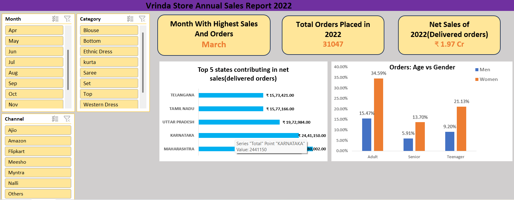
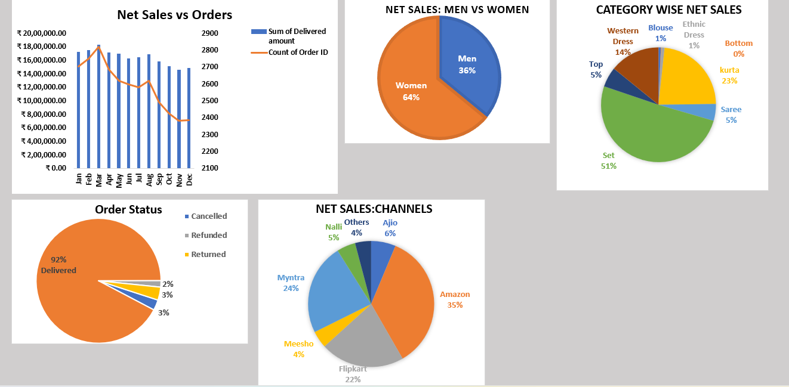

# Vrinda Store Sales Dashboard (Excel)

## Project Overview

This project presents an interactive **Sales Dashboard** built in Microsoft Excel to analyze the performance of *Vrinda Store*. The dashboard provides insights into sales trends, customer behavior, and operational efficiency using real-world business logic.

---

## Dashboard Preview

  
  

## Objectives

* Analyze overall sales performance
* Identify top-performing categories and regions
* Understand customer demographics (gender-based insights)
* Track order status (Delivered, Cancelled, Refunded)
* Derive actionable business insights

---

## Key Metrics (KPIs)

* **Net Sales (₹)** – Based on *Delivered Orders only*
* **Total Orders**

Sales calculations are based only on delivered orders to reflect actual realized revenue.

---

## Dashboard Features

* Monthly Sales Trend Analysis
* Sales by Category
* Sales by State/Region
* Gender-wise Sales Contribution
* Order Status Breakdown
* Interactive Filters using Slicers

---

## Tools & Techniques Used

* Microsoft Excel
* Pivot Tables & Pivot Charts
* Slicers for interactivity
* Data Cleaning & Transformation
* Custom Calculated Columns (e.g., Delivered Amount)

---

## Insights Derived

* Female customers contribute ~65% of total sales, indicating a strong gender skew and potential for targeted marketing strategies.
* Maharashtra, Karnataka, and Uttar Pradesh together contribute ~35% of total sales, making them key revenue-driving regions.
* Customers aged 30–49 years account for ~50% of total sales, highlighting this segment as the primary target audience.
* E-commerce platforms (Amazon, Flipkart, Myntra) contribute ~80% of total sales, showing heavy reliance on marketplace channels.

---

## How to Use

1. Download the Excel file
2. Open in Microsoft Excel
3. Use slicers to filter by:

   * Month
   * Category
   * Gender
   * Order Status

---

## Final conclusion to improve store sales

To maximize revenue, Vrinda Store should focus on high-value customer segments — women aged 30–49 in top-performing states (Maharashtra, Karnataka, Uttar Pradesh) — and deploy targeted digital marketing campaigns on major e-commerce platforms (Amazon, Flipkart, Myntra) using personalized promotions and discounts.

